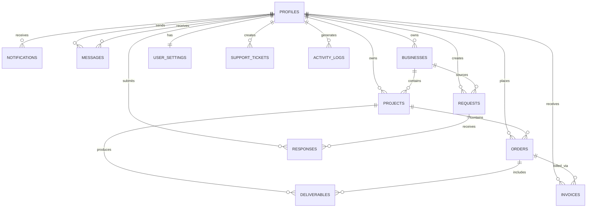

# TechMate Database Schema

## Entity Relationship Diagram

## Tables

### profiles
The central user table, extending `auth.users`.

| Column | Type | Notes |
|--------|------|-------|
| id | UUID (PK) | References `auth.users(id)` |
| email | TEXT | Required |
| full_name | TEXT | |
| role | TEXT | `user`, `admin`, `moderator` |
| user_type | TEXT | `individual`, `business_owner`, `developer`, `admin` |
| is_admin | BOOLEAN | Fast admin check |
| is_active | BOOLEAN | Soft disable |

### projects
Client projects tracked by the platform.

| Column | Type | Notes |
|--------|------|-------|
| id | UUID (PK) | |
| user_id | UUID (FK) | Owner |
| status | TEXT | `planning`, `active`, `review`, `completed`, `cancelled`, `held` |
| progress | INTEGER | 0-100 |
| health_score | INTEGER | 0-100 |
| budget/spent | NUMERIC(12,2) | Financial tracking |

### orders
Individual work orders within projects.

| Column | Type | Notes |
|--------|------|-------|
| id | UUID (PK) | |
| user_id | UUID (FK) | Who placed the order |
| project_id | UUID (FK) | Optional project link |
| type | TEXT | `website`, `app`, `consulting`, `design`, `backend`, `fullstack` |
| status | TEXT | `pending`, `in_progress`, `review`, `completed`, `cancelled` |

### invoices
Financial records with auto-generated invoice numbers.

| Column | Type | Notes |
|--------|------|-------|
| invoice_number | TEXT | Auto-generated `INV-000001` |
| total_amount | NUMERIC | Computed: `amount + tax_amount` |
| status | TEXT | `draft`, `sent`, `paid`, `overdue`, `cancelled`, `refunded` |

### notifications
User notifications with real-time delivery.

### messages
Direct messaging between users with threads.

### requests / responses
Service marketplace for posting and responding to work requests.

### activity_logs
Audit trail for all significant actions.

### admin_metrics
Pre-computed daily metrics for admin dashboard performance.

### service_categories
Lookup table for service types offered.

### user_settings
Per-user preferences (theme, AI settings, notification preferences).

### support_tickets
Customer support ticket system.

---

## Key Database Functions

| Function | Returns | Purpose |
|----------|---------|---------|
| `get_admin_metrics()` | JSONB | All admin dashboard KPIs in one call |
| `get_user_stats(user_id)` | JSONB | User-specific dashboard stats |
| `get_user_growth(months)` | TABLE | Monthly user signup counts |
| `get_revenue_by_month(months)` | TABLE | Monthly revenue data |
| `is_admin()` | BOOLEAN | Check if current user is admin |
| `handle_new_user()` | TRIGGER | Auto-create profile on signup |
| `update_updated_at_column()` | TRIGGER | Auto-update timestamps |
